# Vue Supabase Project — Sistem Kasir & Manajemen Warung

Aplikasi web untuk mengelola produk, pelanggan, transaksi penjualan, antrian pesanan, restock stok (dengan HPP FIFO), dan analisis keuntungan. Frontend dibangun dengan **Vue 3 + Vite + TypeScript**, backend/database menggunakan **Supabase** (PostgreSQL + Auth + Storage).

---

## Daftar Isi

1. [Fitur Utama](#fitur-utama)
2. [Arsitektur Singkat](#arsitektur-singkat)
3. [Prasyarat](#prasyarat)
4. [Setup Supabase (Proyek Baru)](#setup-supabase-proyek-baru)
5. [Konfigurasi Autentikasi di Supabase](#konfigurasi-autentikasi-di-supabase)
6. [Setup Profiles untuk Auth](#setup-profiles-untuk-auth)
7. [Menjalankan DDL Database](#menjalankan-ddl-database)
8. [Konfigurasi Aplikasi Lokal](#konfigurasi-aplikasi-lokal)
9. [Menjalankan Aplikasi](#menjalankan-aplikasi)
10. [Struktur Folder Penting](#struktur-folder-penting)
11. [Rute Aplikasi](#rute-aplikasi)
12. [Konsep Bisnis: Stok & HPP](#konsep-bisnis-stok--hpp)
13. [Diagram Aktivitas (Mermaid)](#diagram-aktivitas-mermaid)
    - [Alur Pesanan Online (Sequence)](#8-alur-pesanan-online--pre-order-ke-antrian-dapur-sequence)
14. [Troubleshooting](#troubleshooting)

---

## Fitur Utama

| Modul | Keterangan |
|-------|------------|
| **Halaman publik (`/`)** | Pencarian pelanggan/produk, lihat hutang, instruksi pembayaran QRIS/transfer |
| **Pesan online (`/order`)** | Pelanggan pilih menu, kirim pre-order (bayar nanti / bayar sekarang) tanpa login |
| **Sukses pesanan (`/order/success`)** | Konfirmasi nomor pesanan + instruksi bayar di kasir setelah pre-order |
| **Pesanan masuk (`/orders/inbox`)** | Staff memproses pre-order menjadi transaksi + antrian opsional |
| **Master Produk** | CRUD produk, harga jual, harga beli default, stok awal, kategori |
| **Master Kategori** | CRUD kategori produk |
| **Master Pembeli** | CRUD pelanggan |
| **Transaksi** | Buat penjualan, bayar / simpan hutang, antrian opsional |
| **Daftar Transaksi** | Filter lunas/hutang, edit qty item |
| **Antrian** | Status: menunggu → disiapkan → siap → diantar → selesai |
| **Layar antrian (`/queue/display`)** | Tampilan fullscreen untuk TV dapur (publik, tanpa login) |
| **Restock** | Tambah stok per batch dengan harga beli & riwayat |
| **Analisis** | Pendapatan, HPP FIFO, laba kotor, chart, ranking produk |
| **Shift kasir (`/shifts`)** | Buka/tutup shift, saldo awal, penjualan per shift, selisih kas |
| **Konfigurasi** | Upload QRIS, data rekening transfer, info struk toko |
| **Profil (`/profile`)** | Ubah nama, password, foto profil (WEBP), bahasa & tema |
| **Pengguna & Role (`/master/users`)** | Owner kelola akun dan role (owner/staff) |

---

## Arsitektur Singkat

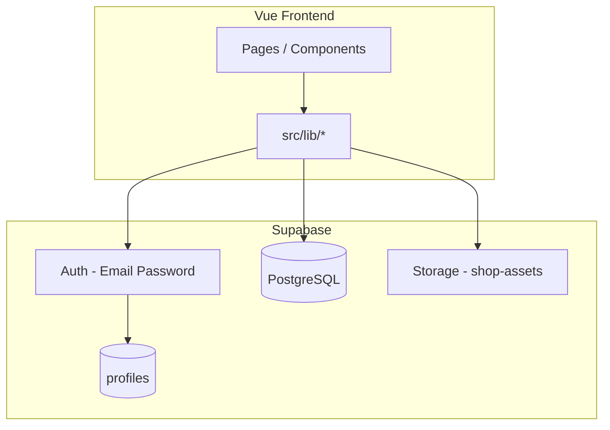

- **Autentikasi**: Supabase Auth (email + password). Token disimpan di cookie browser, divalidasi di `router.beforeEach`.
- **Data**: Semua operasi CRUD via Supabase JS client dengan Row Level Security (RLS).
- **Stok**: Perubahan stok **hanya** lewat `src/lib/stock.ts` → mencatat `stock_movements` + update `products.stock_quantity`.

---

## Prasyarat

- [Node.js](https://nodejs.org/) `^20.19` atau `>=22.12`
- [pnpm](https://pnpm.io/) (disarankan) atau npm
- Akun [Supabase](https://supabase.com/) (gratis cukup untuk development)
- Git (opsional)

---

## Setup Supabase (Proyek Baru)

### 1. Buat proyek

1. Login ke [Supabase Dashboard](https://supabase.com/dashboard).
2. Klik **New project**.
3. Isi nama proyek, password database, dan region (pilih yang terdekat, mis. Singapore).
4. Tunggu hingga proyek selesai diprovisioning.

### 2. Ambil kredensial API

1. Buka proyek → **Project Settings** (ikon gear) → **API**.
2. Catat:
   - **Project URL** → dipakai sebagai `VITE_SUPERBASE_URL`
   - **anon public** key → dipakai sebagai `VITE_SUPERBASE_PUBLISH_KEY`

> **Penting:** Jangan pernah commit file `.env` ke Git. Gunakan `.env.example` sebagai template.

### 3. Aktifkan Email Auth

1. Buka **Authentication** → **Providers**.
2. Pastikan **Email** dalam keadaan **Enabled**.
3. Untuk development, disarankan menonaktifkan konfirmasi email agar bisa langsung login setelah sign-up:
   - **Authentication** → **Providers** → **Email** → matikan **Confirm email**
   - Atau: **Authentication** → **Settings** → **Enable email confirmations** → OFF

---

## Konfigurasi Autentikasi di Supabase

Aplikasi memakai alur berikut:

1. User **Sign Up** (`/sign-up`) → `supabase.auth.signUp()`
2. User **Login** (`/login`) → `supabase.auth.signInWithPassword()`
3. Session disimpan ke cookie: `_access_token`, `_refresh_token`, `_user_email`, dll. (`src/lib/cookies.ts`)
4. Setiap navigasi ke route terproteksi → `validateOrRefreshSession()` di `src/lib/auth.ts`:
   - Coba `setSession` dari cookie
   - Jika gagal → `refreshSession`
   - Jika refresh gagal → logout & redirect ke `/login`
5. Route publik: `/` (halaman pelanggan), `/login`
6. Route terproteksi: semua path lain (dashboard, transaksi, master data, dll.)

### Buat akun login pertama

Jalankan [`21-auth_login_seed.ddl`](DDL/21-auth_login_seed.ddl) di SQL Editor **setelah** `04-profiles_role.ddl`.

1. Buka file tersebut, **ganti** email/password di bagian `select public.seed_login_owner(...)` (default: `owner@warung.local` / `ChangeMe123!`).
2. Run script → akun owner siap dipakai di `/login`.

Script ini juga:
- Membuat baris `auth.users` + `auth.identities` (bisa login langsung)
- Menyinkronkan `public.profiles` untuk semua user auth
- Mengatur role **owner** pada akun seed
- Mengisi `email_confirmed_at` agar tidak terblokir "Email not confirmed"

**Alternatif:** daftar lewat `/sign-up` (user pertama otomatis jadi owner lewat trigger di `04-profiles_role.ddl`).

### Redirect URL (opsional, untuk production)

Di **Authentication** → **URL Configuration**:

- **Site URL**: URL production Anda (mis. `https://warung-anda.com`)
- **Redirect URLs**: tambahkan `http://localhost:5173/**` untuk development

---

## Setup Profiles untuk Auth

Supabase Auth menyimpan akun login di schema `auth.users`. Tabel **`public.profiles`** melengkapi data yang bisa ditampilkan di aplikasi (nama, email) dan terhubung 1:1 dengan user auth.

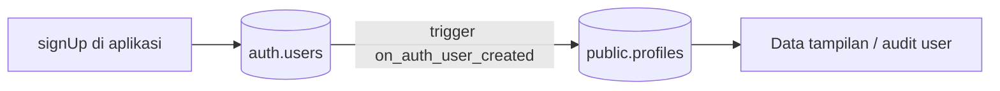

### Mengapa perlu profiles?

| Tanpa `profiles` | Dengan `profiles` |
|------------------|-------------------|
| Nama hanya di cookie `_user_email` | Nama lengkap tersimpan di database |
| Data user tersebar di metadata auth | Satu tabel mudah di-query dari aplikasi |
| User lama tidak punya record terstruktur | Backfill otomatis untuk user yang sudah ada |

### Setup otomatis (DDL)

| Kebutuhan | File |
|-----------|------|
| Tabel `profiles` + trigger signup | [`03-profiles.ddl`](DDL/03-profiles.ddl) |
| Role owner/staff + trigger diperbarui | [`04-profiles_role.ddl`](DDL/04-profiles_role.ddl) |
| Akun login owner + backfill profiles | [`21-auth_login_seed.ddl`](DDL/21-auth_login_seed.ddl) |

Tidak perlu menyalin SQL manual dari README — cukup jalankan file di atas berurutan.

### Verifikasi profiles

Setelah `21-auth_login_seed.ddl`, cek di SQL Editor:

```sql
select
  u.id,
  u.email as auth_email,
  p.full_name,
  p.email as profile_email,
  p.created_at
from auth.users u
left join public.profiles p on p.id = u.id
order by p.created_at desc nulls last;
```

Setiap baris di `auth.users` seharusnya punya pasangan di `profiles`.

### Metadata nama saat sign-up

Aplikasi mengirim `full_name` lewat `user_metadata` saat `signUp()` — trigger `handle_new_user` (di `03` / `04`) menyalinnya ke `profiles.full_name`.

### Diagram: pembuatan profile otomatis

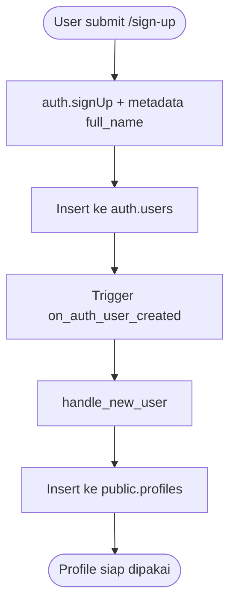

---

## Menjalankan DDL Database

Semua skema SQL ada di folder [`DDL/`](DDL/). Nama file diawali angka urutan (`01-`, `02-`, …) — **jalankan berurutan** di **Supabase SQL Editor**.

> **Instalasi baru:** jalankan **01–21**. File **90–94** hanya untuk database lama (boleh dilewati).

### 01–04 · Fondasi & auth

| File | Keterangan | Lewati jika… |
|------|------------|--------------|
| [`01-customers.ddl`](DDL/01-customers.ddl) | Tabel `customers` + RLS + `handle_updated_at()` | — |
| [`02-roles.ddl`](DDL/02-roles.ddl) | Tabel referensi role (`owner`, `staff`) | — |
| [`03-profiles.ddl`](DDL/03-profiles.ddl) | Tabel `profiles` + trigger dari `auth.users` | — |
| [`04-profiles_role.ddl`](DDL/04-profiles_role.ddl) | Kolom `profiles.role`, `is_owner()`, trigger signup | — |

### 05–09 · Master data & transaksi

| File | Keterangan | Lewati jika… |
|------|------------|--------------|
| [`05-product.ddl`](DDL/05-product.ddl) | Tabel `products` + RLS | — |
| [`06-product_categories.ddl`](DDL/06-product_categories.ddl) | Kategori + `category_id` di produk | — |
| [`07-transactions.ddl`](DDL/07-transactions.ddl) | `transactions`, `transaction_items`, walk-in | — |
| [`08-transaction_payment_method.ddl`](DDL/08-transaction_payment_method.ddl) | Kolom `payment_method`, `paid_at` | Sudah ada di `07-transactions.ddl` |
| [`09-product_addons.ddl`](DDL/09-product_addons.ddl) | Addon produk + `transaction_item_addons` | — |

### 10–11 · Konfigurasi toko

| File | Keterangan | Lewati jika… |
|------|------------|--------------|
| [`10-shop_config.ddl`](DDL/10-shop_config.ddl) | `shop_config` + bucket `shop-assets` | — |
| [`11-shop_config_invoice.ddl`](DDL/11-shop_config_invoice.ddl) | `shop_name`, `shop_address` untuk struk | Sudah ada di `10-shop_config.ddl` |

### 12–16 · Operasional (antrian & pre-order)

| File | Keterangan | Lewati jika… |
|------|------------|--------------|
| [`12-order_queues.ddl`](DDL/12-order_queues.ddl) | Antrian dapur | — |
| [`13-order_queues_realtime.ddl`](DDL/13-order_queues_realtime.ddl) | Realtime antrian | — |
| [`14-order_queues_daily_reset.ddl`](DDL/14-order_queues_daily_reset.ddl) | Reset nomor antrian harian | — |
| [`15-pre_orders.ddl`](DDL/15-pre_orders.ddl) | Pre-order publik + realtime | — |
| [`16-pre_orders_confirmed_payment.ddl`](DDL/16-pre_orders_confirmed_payment.ddl) | Konfirmasi bayar `pay_now` | — |

### 17–19 · Stok & shift kasir

| File | Keterangan | Lewati jika… |
|------|------------|--------------|
| [`17-stock_movements.ddl`](DDL/17-stock_movements.ddl) | Audit stok / HPP | — |
| [`18-stock_lot_allocations.ddl`](DDL/18-stock_lot_allocations.ddl) | Alokasi FIFO | — |
| [`19-cashier_shifts.ddl`](DDL/19-cashier_shifts.ddl) | Shift kasir + `transactions.shift_id` | — |

### 20–21 · Keamanan & login

| File | Keterangan | Lewati jika… |
|------|------------|--------------|
| [`20-role_owner_policies.ddl`](DDL/20-role_owner_policies.ddl) | RLS tulis master data & restock (owner) | — |
| [`21-auth_login_seed.ddl`](DDL/21-auth_login_seed.ddl) | Akun owner awal + sinkronisasi profiles | — |

### 90–94 · Migrasi database lama (opsional)

| File | Keterangan | Lewati jika… |
|------|------------|--------------|
| [`90-product_purchase_price.ddl`](DDL/90-product_purchase_price.ddl) | Tambah `purchase_price` | `05-product.ddl` sudah dipakai |
| [`91-stock_movements_costing.ddl`](DDL/91-stock_movements_costing.ddl) | Kolom costing stok | `17-stock_movements.ddl` sudah lengkap |
| [`92-order_queues_table_number.ddl`](DDL/92-order_queues_table_number.ddl) | Tambah `table_number` antrian | `12-order_queues.ddl` sudah dipakai |
| [`93-product_is_addons.ddl`](DDL/93-product_is_addons.ddl) | Migrasi `product_type` → `is_addons` | DB tidak pakai `product_type` |
| [`94-masterdata_policies.ddl`](DDL/94-masterdata_policies.ddl) | Perbaiki RLS master data (403) | `20-role_owner_policies.ddl` sudah cukup |

### Cara menjalankan di SQL Editor

1. Buka file `.ddl` berikutnya (urutkan berdasarkan prefix angka di folder `DDL/`).
2. Salin seluruh isinya.
3. Di Supabase → **SQL** → **New query** → paste → **Run**.
4. Pastikan muncul pesan sukses sebelum lanjut ke file berikutnya.

### Verifikasi cepat

Jalankan query ini setelah semua DDL:

```sql
select table_name
from information_schema.tables
where table_schema = 'public'
  and table_name in (
    'customers', 'profiles', 'products', 'transactions', 'transaction_items',
    'shop_config', 'order_queues', 'pre_orders', 'pre_order_items', 'pre_order_item_addons',
    'stock_movements', 'stock_lot_allocations'
  )
order by table_name;
```

Harus mengembalikan **12** baris.

---

## Konfigurasi Aplikasi Lokal

### 1. Clone & install dependency

```sh
cd vue-superbase-project
pnpm install
```

### 2. Buat file `.env`

Salin dari `.env.example`:

```sh
cp .env.example .env
```

Isi nilai:

```env
VITE_SUPERBASE_URL=https://xxxxxxxx.supabase.co
VITE_SUPERBASE_PUBLISH_KEY=eyJhbGciOiJIUzI1NiIsInR5cCI6IkpXVCJ9...

# Opsional: nomor WA untuk kirim bukti bayar dari halaman publik (format: 6281234567890)
VITE_PAYMENT_PROOF_WHATSAPP=6281234567890

# Opsional: history (default) atau hash — hash untuk deploy tanpa server rewrite
# VITE_ROUTER_MODE=hash
```

---

## Menjalankan Aplikasi

```sh
# Development (hot reload)
pnpm dev

# Build production
pnpm build

# Preview build
pnpm preview

# Lint
pnpm lint
```

Buka browser: `http://localhost:5173`

| URL | Akses |
|-----|-------|
| `/`, `/order`, `/order/success`, `/queue/display` | Publik — tanpa login |
| `/login`, `/sign-up` | Guest |
| `/dashboard`, `/profile`, `/transactions`, `/master/products`, dll. | Harus login |

---

## Struktur Folder Penting

```
vue-superbase-project/
├── DDL/                    # Skrip SQL Supabase (01–21 instalasi baru, 90–94 migrasi)
├── src/
│   ├── pages/              # Halaman per route
│   ├── components/         # UI & form
│   ├── lib/
│   │   ├── supabase.ts     # Klien Supabase
│   │   ├── auth.ts         # Login, session, refresh
│   │   ├── product.ts      # Master produk
│   │   ├── transaction.ts  # Penjualan & hutang
│   │   ├── stock.ts        # Restock, FIFO, pergerakan stok
│   │   ├── queue.ts        # Antrian
│   │   ├── analytics.ts    # Laporan laba
│   │   └── config.ts       # QRIS & rekening
│   ├── types/database.ts   # TypeScript types
│   └── router/index.ts     # Route guard auth
├── .env.example
└── package.json
```

---

## Rute Aplikasi

| Path | Halaman | Grup sidebar |
|------|---------|--------------|
| `/` | Pencarian publik | — |
| `/order` | Pesan menu (publik) | — |
| `/order/success` | Konfirmasi pesanan + nomor antrian kasir (publik) | — |
| `/queue/display` | Layar antrian TV dapur (publik) | — |
| `/login` | Login | — |
| `/sign-up` | Daftar akun | — |
| `/dashboard` | Dashboard ringkasan | Beranda |
| `/profile` | Profil akun (nama, password, foto) | Akun (menu user) |
| `/orders/inbox` | Pesanan masuk dari publik | Operasional |
| `/transactions` | Buat transaksi | Operasional |
| `/transactions/list` | Daftar transaksi | Operasional |
| `/queue` | Kelola antrian dapur | Operasional |
| `/stock/restock` | Restock | Operasional |
| `/analytics` | Analisis keuntungan | Laporan |
| `/shifts` | Shift kasir (buka/tutup, ringkasan harian) | Laporan |
| `/master/products` | Master produk | Master Data |
| `/master/categories` | Master kategori | Master Data |
| `/master/customers` | Master pembeli | Master Data |
| `/master/users` | Pengguna & role (owner only) | Master Data |
| `/config` | Konfigurasi toko | Pengaturan |

---

## Konsep Bisnis: Stok & HPP

| Istilah | Arti di aplikasi ini |
|---------|----------------------|
| **Harga jual** | `products.price` — harga ke pelanggan |
| **Harga beli (default)** | `products.purchase_price` — pre-fill saat restock |
| **Harga beli per batch** | `stock_movements.unit_cost` — terkunci saat restock |
| **HPP** | Harga Pokok Penjualan = biaya stok yang terpakai saat dijual (FIFO) |
| **Laba kotor** | Pendapatan − HPP |

Alur stok:

- **Restock** → tambah stok + catat batch dengan `unit_cost`
- **Penjualan** → kurangi stok FIFO + catat `sale` movement dengan `total_cost` (HPP)
- **Edit transaksi** → penyesuaian stok via `adjustment` / `sale` delta

---

## Diagram Aktivitas (Mermaid)

Sub-bagian penting:
- **§5** — Antrian dapur (status `waiting` → `preparing` → `ready` → `serving` → `completed`)
- **§8** — [Alur pesanan online lengkap](#8-alur-pesanan-online--pre-order-ke-antrian-dapur-sequence) (pre-order → bayar → antrian → selesai)

### 1. Autentikasi (Login & Session Guard)

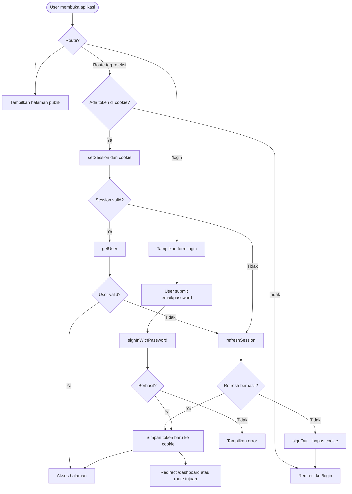

### 2. Registrasi Akun Baru

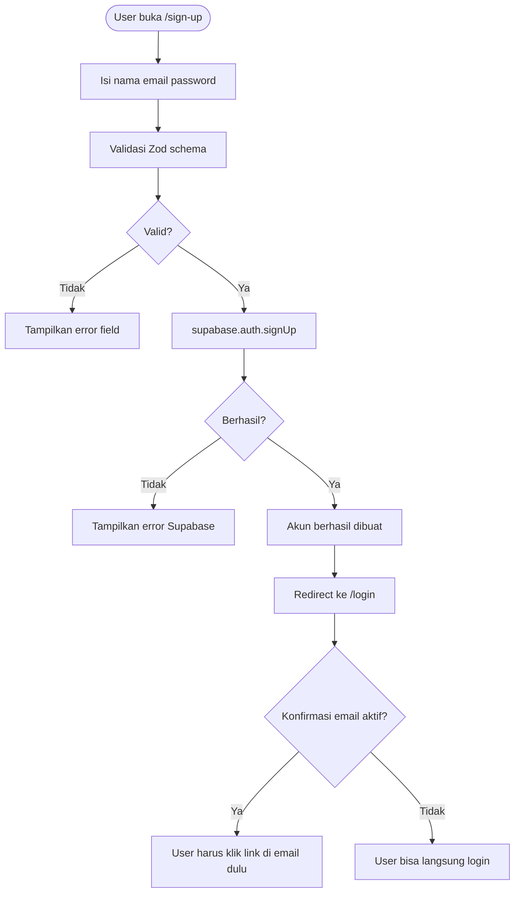

### 3. Buat Transaksi & Pengaruh Stok

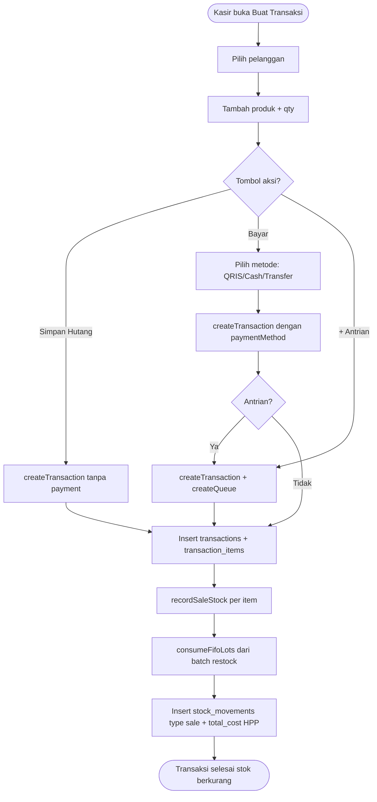

### 4. Restock Produk

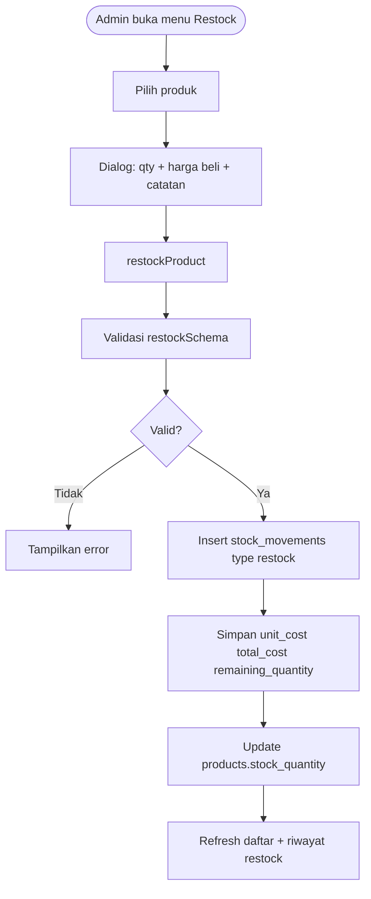

### 5. Antrian Pesanan (Dapur)

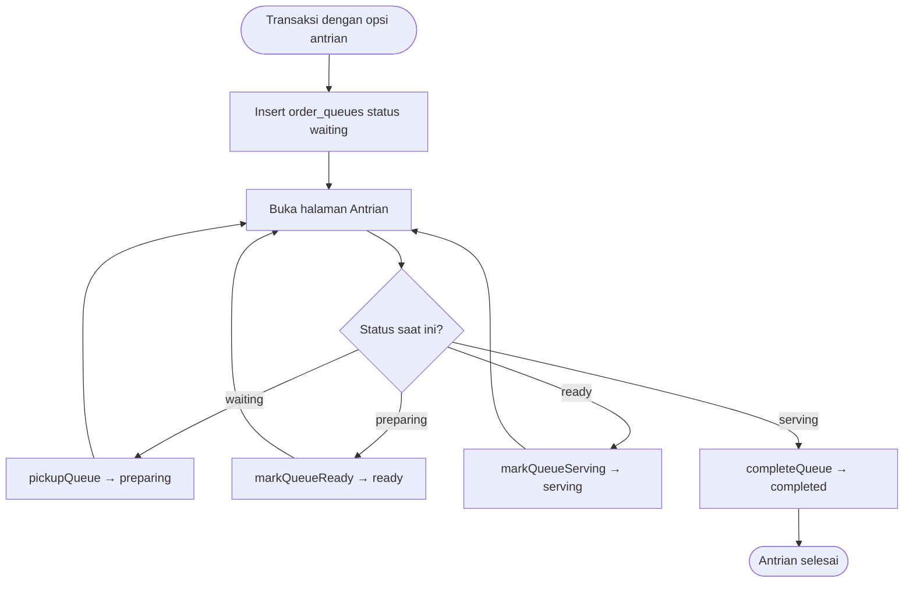

### 6. Halaman Publik — Cek Hutang Pelanggan

```mermaid
flowchart TD
  start([Pelanggan buka "/"]) --> search[Ketik nama pelanggan]
  search --> query[getCustomers + getCustomersWithDebt]
  query --> showList[Tampilkan kartu pelanggan + nominal hutang]
  showList --> clickCard{Klik pelanggan?}
  clickCard -->|Ya| unpaidDialog[Dialog item belum lunas]
  unpaidDialog --> payCTA{Mau bayar?}
  payCTA -->|Ya| paymentDialog[Instruksi QRIS / Transfer dari shop_config]
  paymentDialog --> waOpsional[Kirim bukti via WhatsApp jika dikonfigurasi]
  clickCard -->|Tidak| search
```

### 7. Analisis Keuntungan

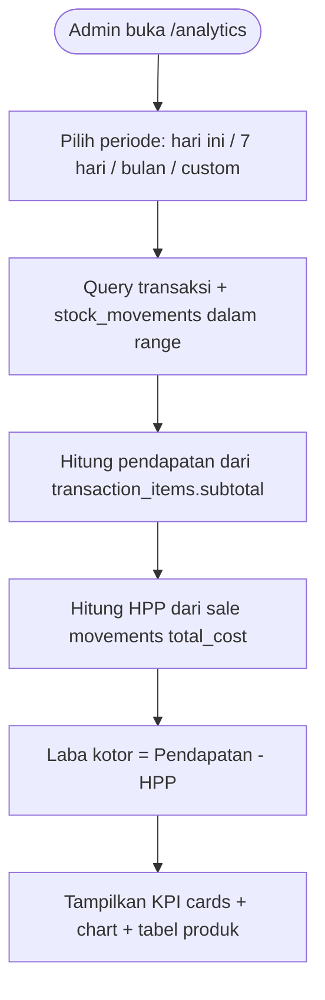

### 8. Alur Pesanan Online — Pre-order ke Antrian Dapur (Sequence)

Diagram ini menggambarkan alur pesanan dari halaman publik `/order` hingga selesai di dapur. Aplikasi memanggil Supabase langsung (tanpa backend API terpisah); pembaruan antrian disiarkan lewat **Supabase Realtime**.

**Ringkasan status antrian:**

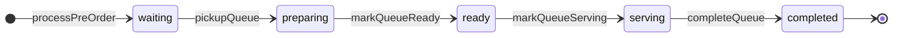

| Status | Arti | Tombol di `/queue` |
|--------|------|-------------------|
| `waiting` | Menunggu diproses dapur | Pickup |
| `preparing` | Sedang dimasak / disiapkan | Siap |
| `ready` | Siap diantar ke pelanggan | Antar |
| `serving` | Sedang diantarkan ke meja | Selesai |
| `completed` | Pelanggan sudah menerima | — |

**Sequence diagram lengkap:**

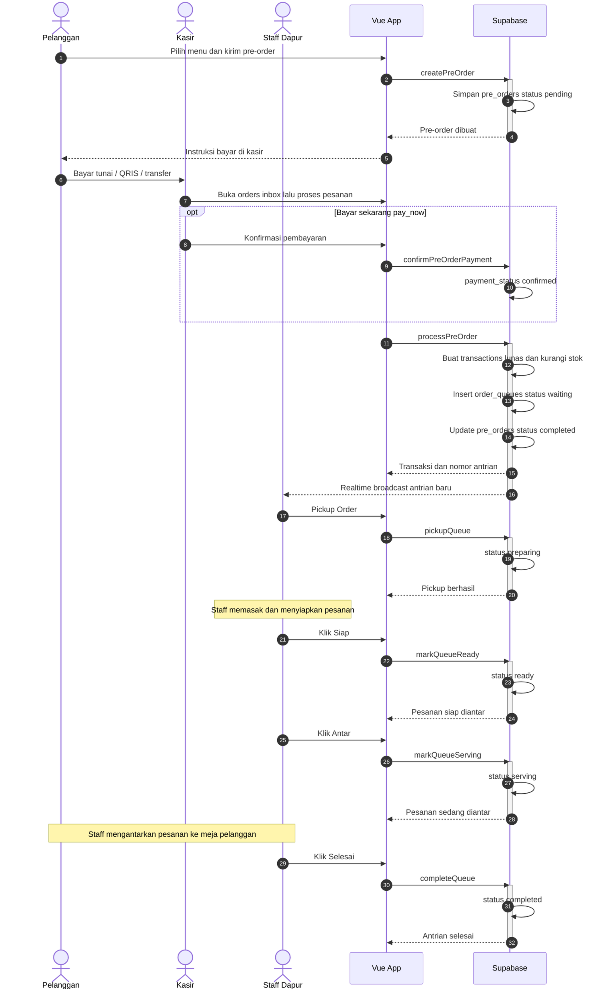

| Tahap | Status di database | Halaman / aksi |
|-------|-------------------|----------------|
| Pre-order masuk | `pre_orders.status = pending` | `/order` → `createPreOrder()` |
| Menunggu bayar | `payment_status = unpaid` atau `awaiting_confirmation` | `/order/success` |
| Masuk antrian | `order_queues.status = waiting` | `/orders/inbox` → `processPreOrder()` |
| Disiapkan | `order_queues.status = preparing` | `/queue` → `pickupQueue()` |
| Siap diantar | `order_queues.status = ready` | `/queue` → `markQueueReady()` |
| Sedang diantar | `order_queues.status = serving` | `/queue` → `markQueueServing()` |
| Selesai | `order_queues.status = completed` | `/queue` → `completeQueue()` |

> **Catatan:** Kasir juga bisa membuat transaksi langsung di `/transactions` tanpa pre-order. Jika opsi antrian diaktifkan, alur dapur tetap: `waiting` → `preparing` → `ready` → `serving` → `completed`.

---

## Troubleshooting

| Masalah | Solusi |
|---------|--------|
| Login gagal "Invalid login credentials" | Cek email/password; pastikan user sudah confirmed di Supabase |
| Sign up tidak bisa login | Matikan **Confirm email** di Supabase Auth, atau konfirmasi lewat email |
| Setelah sign-up, `profiles` kosong | Jalankan [`21-auth_login_seed.ddl`](DDL/21-auth_login_seed.ddl) atau pastikan `03` + `04` sudah dijalankan |
| Login gagal "Email not confirmed" | Jalankan [`21-auth_login_seed.ddl`](DDL/21-auth_login_seed.ddl) atau matikan Confirm email di Dashboard Auth |
| User Dashboard tanpa baris `profiles` | Jalankan query backfill di bagian [Setup Profiles](#langkah-5--opsional-user-admin-via-dashboard) |
| Insert produk/pelanggan **403** | Jalankan [`94-masterdata_policies.ddl`](DDL/94-masterdata_policies.ddl) atau pastikan [`20-role_owner_policies.ddl`](DDL/20-role_owner_policies.ddl) + login sebagai owner |
| Upload QRIS gagal | Pastikan [`10-shop_config.ddl`](DDL/10-shop_config.ddl) sudah dijalankan (bucket `shop-assets`) |
| HPP selalu 0 | Isi **harga beli** saat tambah produk atau restock; data lama mungkin belum punya costing |
| Penjualan gagal "stok batch tidak mencukupi" | Restock dulu atau jalankan [`91-stock_movements_costing.ddl`](DDL/91-stock_movements_costing.ddl) untuk backfill batch |
| Variable env tidak terbaca | Nama harus `VITE_SUPERBASE_URL` dan `VITE_SUPERBASE_PUBLISH_KEY`; restart `pnpm dev` setelah ubah `.env` |
| Antrian tidak update otomatis | Jalankan [`13-order_queues_realtime.ddl`](DDL/13-order_queues_realtime.ddl), atau Database → Publications → `supabase_realtime` → tambah `order_queues` |
| Badge Live tidak muncul di Antrian | Pastikan sudah login; cek koneksi WebSocket ke Supabase tidak diblokir firewall |

---

## Lisensi

Proyek private — sesuaikan lisensi sesuai kebutuhan tim Anda.
